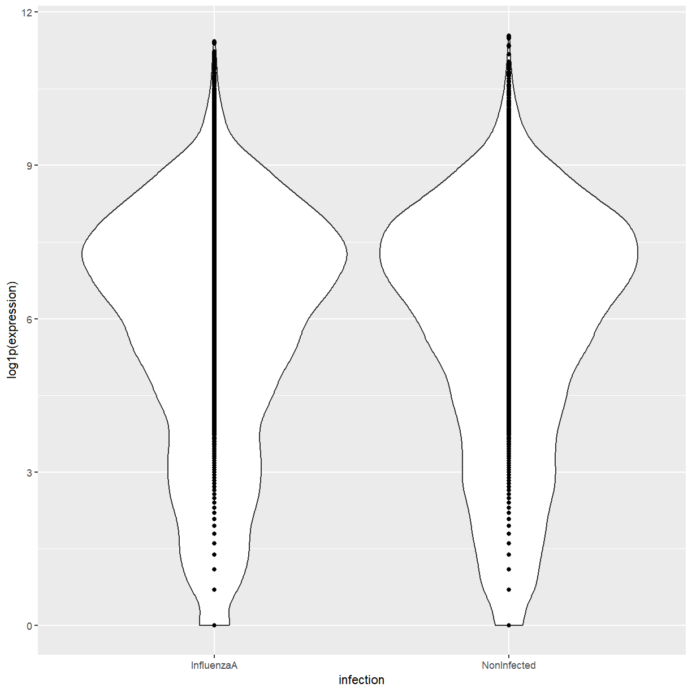
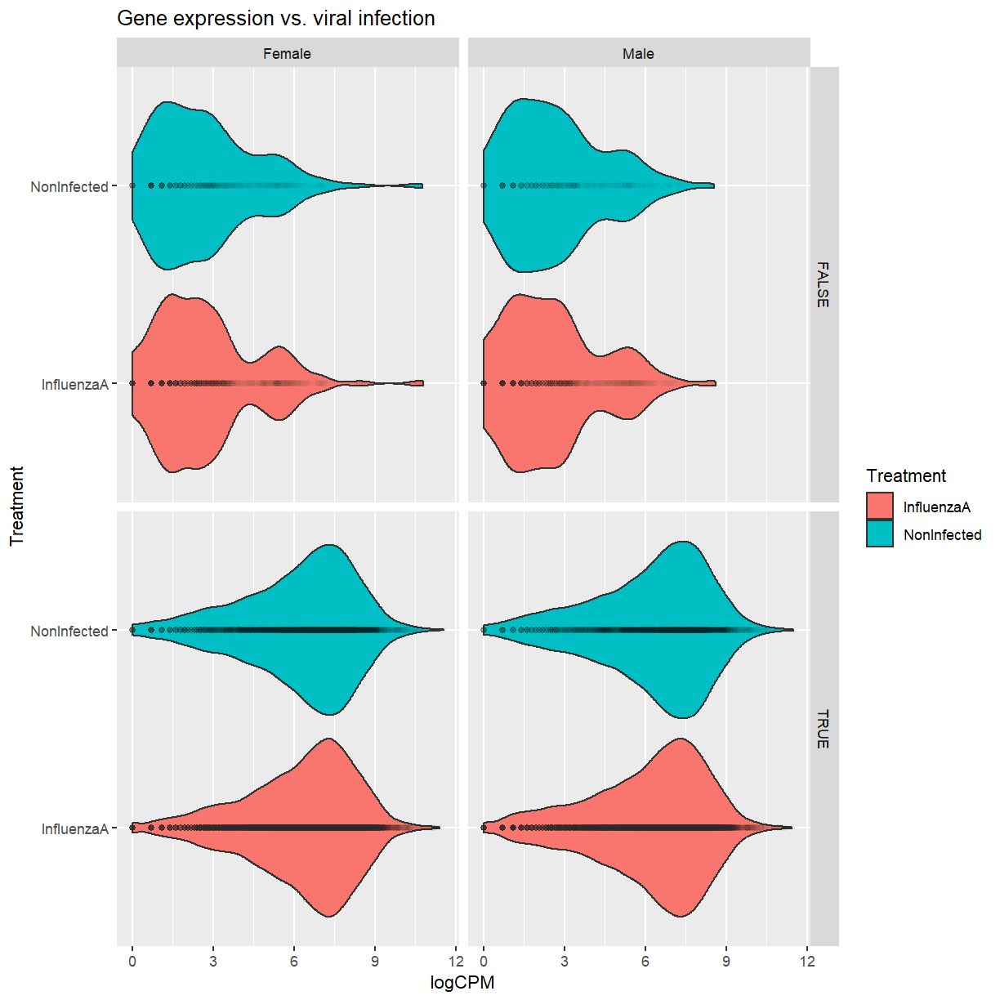

---
# Please do not edit this file directly; it is auto generated.
# Instead, please edit 30-graphics-with-ggplot2.md in _episodes_rmd/
source: Rmd
title: "Graphics with ggplot2"
teaching: XX
exercises: XX
questions:
- "How can I generate plots from tabular data in R?"
objectives:
- Make scatter plots and box plots to display your data.
- Use aesthetics to change how variables map to axes, color, or size.
keypoints:
- "Although other plotting systems exist in R, ggplot2 is a good choice for beginners because it is very powerful and relatively user-friendly."
- "Different components of the plot can be added together, much like layers in a Photoshop document."
---

## Setup

### Dataset for this lesson

If you don't already have it from the previous lesson, download the dataset from
[Blackmore *et al.* (2017)](https://www.ncbi.nlm.nih.gov/pmc/articles/PMC5544260/)
and read it into R:

~~~
if (!file.exists("data/rnaseq.csv"))
    download.file(url = "https://raw.githubusercontent.com/UCLouvain-CBIO/WSBIM1207/scrnadata/data/rnaseq.csv",
                  destfile = "data/rnaseq.csv")

rna <- read.csv("data/rnaseq.csv")

head(rna)
~~~
{: .language-r}

~~~
     gene     sample expression     organism age    sex  infection  strain time
1     Asl GSM2545336       1170 Mus musculus   8 Female InfluenzaA C57BL/6    8
2    Apod GSM2545336      36194 Mus musculus   8 Female InfluenzaA C57BL/6    8
3 Cyp2d22 GSM2545336       4060 Mus musculus   8 Female InfluenzaA C57BL/6    8
4    Klk6 GSM2545336        287 Mus musculus   8 Female InfluenzaA C57BL/6    8
5   Fcrls GSM2545336         85 Mus musculus   8 Female InfluenzaA C57BL/6    8
6  Slc2a4 GSM2545336        782 Mus musculus   8 Female InfluenzaA C57BL/6    8
      tissue mouse ENTREZID
1 Cerebellum    14   109900
2 Cerebellum    14    11815
3 Cerebellum    14    56448
4 Cerebellum    14    19144
5 Cerebellum    14    80891
6 Cerebellum    14    20528
                                                                   product
1                            argininosuccinate lyase transcript variant X1
2                                    apolipoprotein D transcript variant 3
3 cytochrome P450 family 2 subfamily d polypeptide 22 transcript variant 2
4                      kallikrein related-peptidase 6 transcript variant 2
5              Fc receptor-like S scavenger receptor transcript variant X1
6       solute carrier family 2 (facilitated glucose transporter) member 4
     ensembl_gene_id external_synonym chromosome_name   gene_biotype
1 ENSMUSG00000025533    2510006M18Rik               5 protein_coding
2 ENSMUSG00000022548             <NA>              16 protein_coding
3 ENSMUSG00000061740             2D22              15 protein_coding
4 ENSMUSG00000050063             Bssp               7 protein_coding
5 ENSMUSG00000015852    2810439C17Rik               3 protein_coding
6 ENSMUSG00000018566           Glut-4              11 protein_coding
                            phenotype_description
1           abnormal circulating amino acid level
2                      abnormal lipid homeostasis
3                        abnormal skin morphology
4                         abnormal cytokine level
5 decreased CD8-positive alpha-beta T cell number
6              abnormal circulating glucose level
  hsapiens_homolog_associated_gene_name
1                                   ASL
2                                  APOD
3                                CYP2D6
4                                  KLK6
5                                 FCRL4
6                                SLC2A4
~~~
{: .output}

### Install and load ggplot2

The default R installation does not include ggplot2, so you will need to install
it if you haven't already:

~~~
install.packages("ggplot2")
~~~
{: .language-r}

And then you'll load it with `library` in order to use it:

~~~
library(ggplot2)
~~~
{: .language-r}

## Getting help

The [website for ggplot2](https://ggplot2.tidyverse.org/) has a cheatsheet and
other useful documentation.  This is a very popular R package, so Google and
Stack Overflow are also very helpful for getting answers!

Since we'll be doing a lot of multi-line commands, it's very easy to accidentally
send an incomplete command to the console.  If you are trying to execute ggplot
commands and nothing is happening, look at the prompt in the lower left.  If it
is a `+` instead of a `>`, click to put your cursor down there and then hit the
<kbd>Esc</kbd> key.

## Your first plots

The base R installation has the `plot` function and some other functions
for generating plots.  You can make a scatter plot or box plot pretty
quickly this way, but it might not look very nice.  Remember that `$` extracts
one column from a data frame and returns it as a vector.

> ## Data transformation
> 
> Because the gene expression data are not normally distributed, here we are
> using the `log1p` function to log transform them.  Because the log of zero
> is negative infinity, and because we have zeros in our dataset, `log1p`
> adds one before log transforming.
{: .callout}

~~~
plot(x = rna$time, y = log1p(rna$expression))
~~~
{: .language-r}

~~~
plot(x = as.factor(rna$infection), y = log1p(rna$expression))
~~~
{: .language-r}

I can make the same plots with ggplot2, and hopefully both the code and the
graphics will look a bit better.  (Note that although the package is called
ggplot2, the function is `ggplot`.)

~~~
ggplot(rna, aes(x = time, y = log1p(expression))) +
  geom_point()
~~~
{: .language-r}

~~~
ggplot(rna, aes(x = infection, y = log1p(expression))) +
  geom_boxplot()
~~~
{: .language-r}

## Components of a ggplot command

### Call to `ggplot`

In both of the above plots, you'll notice that the first command we used was
`ggplot`.  If you look at the help page for that function, you'll see that there
are two arguments (or, at least, two arguments that can be used): `data` and
`mapping`.  We gave the `data` argument our data frame.  What does this look like
by itself?

~~~
ggplot(rna)
~~~
{: .language-r}

It basically opened an empty plot, because we gave it data but didn't say anything
about what to do with it.

To the `mapping` argument, we supplied an object that we created using the `aes`
function.  The `aes` function does not have any use outside of ggplot2, but within
ggplot2 it indicates how the variables from the data frame should be used in
the plot.  The function knows to look for variable names in the column names of
the data frame that was supplied, which is very helpful.  What do we get when
we add this in?

~~~
ggplot(rna, aes(x = infection, y = log1p(expression)))
~~~
{: .language-r}

Now the axes are set up because we've said what we're putting onto them, but
we still haven't plotted anything.

### Geoms

Now we need to add one or more "geoms" to the command to plot our data.
Previously we added a box plot.  We could also do a violin plot, which is a hybrid
between a box plot and density plot.

Notice the use of the `+` sign to combine different commands.  That's pretty
different from the syntax of any other R package, but it's how we do things with
ggplot!

~~~
ggplot(rna, aes(x = infection, y = log1p(expression))) +
  geom_violin()
~~~
{: .language-r}

There can be multiple geoms in one plot.

~~~
ggplot(rna, aes(x = infection, y = log1p(expression))) +
  geom_violin() +
  geom_point()
~~~
{: .language-r}

> ## Challenge: Changing the geom order
>
> Try switching `geom_point` with `geom_violin` in the above command, so that
> `geom_point` is first and `geom_violin` is second.  What happens?
>
> > ## Solution
> > 
> > Most of the points are no longer visible, because they are now underneath
> > the violin plot.  Geoms are plotted in the order they appear in the command.
> >
> > 
> > ~~~
> > ggplot(rna, aes(x = infection, y = log1p(expression))) +
> >   geom_point() +
> >   geom_violin()
> > ~~~
> > {: .language-r}
> > 
> > 
> {: .solution}
{: .challenge}

In these examples, we didn't provide any arguments to the geom functions.
However, they have their own `data` and `mapping` arguments if you want to
override what was provided in the `ggplot` function.

~~~
ggplot(rna, aes(x = infection, y = log1p(expression))) +
  geom_violin() +
  geom_point(mapping = aes(y = log1p(expression) + 10))
~~~
{: .language-r}

A quick way to see what other geoms are available is to start typing
`geom` into your R console and look at the autocomplete list.

### More aesthetics

If I look at `?geom_violin` and scroll down to the "Aesthetics" section, there
is a list of other aesthetics we can control.  Although I have treatment on the
x-axis, it might help visually to also color by treatment.  Since this only
applies to one geom, I'll only pass it to that one.

~~~
ggplot(rna, aes(x = infection, y = log1p(expression))) +
  geom_violin(mapping = aes(fill = infection)) +
  geom_point()
~~~
{: .language-r}

To change an aesthethic value across the board, rather than have it indicate the
value of a variable, we can define it outside of the `mapping` argument.  For
example, I can set `alpha` to control point transparency.

~~~
ggplot(rna, aes(x = infection, y = log1p(expression))) +
  geom_violin(mapping = aes(fill = infection)) +
  geom_point(alpha = 0.01)
~~~
{: .language-r}

### Titles and axis labels

You might want your plot to have a title, or for the axis labels to be something
different from the variable names.  We'll use the `labs` function for that.

~~~
ggplot(rna, aes(x = infection, y = log1p(expression))) +
  geom_violin(mapping = aes(fill = infection)) +
  geom_point(alpha = 0.01) +
  labs(x = "Treatment", fill = "Treatment", y = "logCPM",
       title = "Gene expression vs. viral infection")
~~~
{: .language-r}

### Facets

When you are working with a lot of variables, it might make sense to split the
graph into multiple plots.  We can do that with the `facet_wrap` and `facet_grid`
functions.

~~~
ggplot(rna, aes(x = infection, y = log1p(expression))) +
  geom_violin(mapping = aes(fill = infection)) +
  geom_point(alpha = 0.01) +
  labs(x = "Treatment", fill = "Treatment", y = "logCPM",
       title = "Gene expression vs. viral infection") +
  facet_wrap(~ sex)
~~~
{: .language-r}

You can either use variables straight from your data frame, or create
expressions in place, like `gene_biotype == "protein_coding"`.

~~~
ggplot(rna, aes(x = infection, y = log1p(expression))) +
  geom_violin(mapping = aes(fill = infection)) +
  geom_point(alpha = 0.01) +
  labs(x = "Treatment", fill = "Treatment", y = "logCPM",
       title = "Gene expression vs. viral infection") +
  facet_grid(gene_biotype == "protein_coding" ~ sex)
~~~
{: .language-r}

Now we can see that for non-coding mRNAs, the distribution of expression
depends both on sex and infection status.

### Scales

I log-transformed my gene expression before plotting, but maybe I'd prefer
to see it in the original units.  I can change how my y-axis is set up
with `scale_y_continuous`.  The `trans` argument says how I want to transform
the axis, and the `breaks` argument tells it where to put axis ticks and grid
lines.

~~~
ggplot(rna, aes(x = infection, y = expression)) +
  geom_violin(mapping = aes(fill = infection)) +
  geom_point(alpha = 0.01) +
  labs(x = "Treatment", fill = "Treatment", y = "Expression",
       title = "Gene expression vs. viral infection") +
  facet_grid(gene_biotype == "protein_coding" ~ sex) +
  scale_y_continuous(trans = "log1p",
                     breaks = c(0, 1e2, 1e3, 1e4, 1e5, 1e6))
~~~
{: .language-r}

> ## Challenge: Changing the fill colors
>
> I'd like the violin plots to be filled with something other than the default
> salmon and teal.  Look at the help page for `scale_fill_manual` and see if
> you can figure out how to use it.  You can specify colors with simple strings
> like `"green"` and `"blue"`.
> 
> If you have extra time, you can play around with color names from
> [this list](http://www.stat.columbia.edu/~tzheng/files/Rcolor.pdf).
> You can also use a [color picker](https://www.w3schools.com/colors/colors_picker.asp)
> to generate custom color strings like `"#4d94ff"`.  Lastly, you can Google your
> university name and "hex colors" to get your official school colors
> (also as the `#` character followed by six numbers and letters).
>
> **Hint**: Regardless of which colors you use, you will need to use the `c()`
> command to create a character vector of colors.  Color names always need to be
> in quotes.
>
> > ## Solution
> >
> > The `values` argument to `scale_fill_manual` tells it what colors to use.
> >
> > 
> > ~~~
> > ggplot(rna, aes(x = infection, y = expression)) +
> >  geom_violin(mapping = aes(fill = infection)) +
> >  geom_point(alpha = 0.01) +
> >  labs(x = "Treatment", fill = "Treatment", y = "Expression",
> >       title = "Gene expression vs. viral infection") +
> >  facet_grid(gene_biotype == "protein_coding" ~ sex) +
> >  scale_y_continuous(trans = "log1p",
> >                     breaks = c(0, 1e2, 1e3, 1e4, 1e5, 1e6)) +
> >  scale_fill_manual(values = c("darkolivegreen4",
> >                               "royalblue"))
> > ~~~
> > {: .language-r}
> > 
> > 
> >
> > I often like to build a color key vector that I can reuse for all my plots.
> > It not only saves me some typing, but it makes it easy to change the colors
> > later!  The vector can be named in order to be explicit about which colors
> > go with which values.
> >
> > 
> > ~~~
> > mycolorkey <- c("InfluenzaA" = "darkolivegreen4",
> >                 "NonInfected" = "royalblue")
> > 
> > ggplot(rna, aes(x = infection, y = expression)) +
> >  geom_violin(mapping = aes(fill = infection)) +
> >  geom_point(alpha = 0.01) +
> >  labs(x = "Treatment", fill = "Treatment", y = "Expression",
> >       title = "Gene expression vs. viral infection") +
> >  facet_grid(gene_biotype == "protein_coding" ~ sex) +
> >  scale_y_continuous(trans = "log1p",
> >                     breaks = c(0, 1e2, 1e3, 1e4, 1e5, 1e6)) +
> >  scale_fill_manual(values = mycolorkey)
> > ~~~
> > {: .language-r}
> > 
> > 
> {: .solution}
{: .challenge}

### Themes

If you want to change something like grid lines or the angle of axis tick labels,
you probably want to add a `theme` command.  There are some pre-built themes, for
example:

~~~
ggplot(rna, aes(x = infection, y = log1p(expression))) +
  geom_violin(mapping = aes(fill = infection)) +
  geom_point(alpha = 0.01) +
  labs(x = "Treatment", fill = "Treatment", y = "logCPM",
       title = "Gene expression vs. viral infection") +
  facet_grid(gene_biotype == "protein_coding" ~ sex) +
  theme_bw()
~~~
{: .language-r}

If I just wanted to change the font:

~~~
ggplot(rna, aes(x = infection, y = log1p(expression))) +
  geom_violin(mapping = aes(fill = infection)) +
  geom_point(alpha = 0.01) +
  labs(x = "Treatment", fill = "Treatment", y = "logCPM",
       title = "Gene expression vs. viral infection") +
  facet_grid(gene_biotype == "protein_coding" ~ sex) +
  theme(text = element_text(family = "serif"))
~~~
{: .language-r}

Rotating axis labels:

~~~
ggplot(rna, aes(x = infection, y = log1p(expression))) +
  geom_violin(mapping = aes(fill = infection)) +
  geom_point(alpha = 0.01) +
  labs(x = "Treatment", fill = "Treatment", y = "logCPM",
       title = "Gene expression vs. viral infection") +
  facet_grid(gene_biotype == "protein_coding" ~ sex) +
  theme(text = element_text(family = "serif"),
        axis.text.x = element_text(angle = 90, vjust = 0.5, hjust = 1))
~~~
{: .language-r}

There are too many options here to unpack in a short lesson, but look
at `?theme` and `?element_text` for more information.

### Coordinate systems

What if I want to rotate my plot 90 degrees?  I can do that with `coord_flip`.

~~~
ggplot(rna, aes(x = infection, y = log1p(expression))) +
  geom_violin(mapping = aes(fill = infection)) +
  geom_point(alpha = 0.01) +
  labs(x = "Treatment", fill = "Treatment", y = "logCPM",
       title = "Gene expression vs. viral infection") +
  facet_grid(gene_biotype == "protein_coding" ~ sex) +
  coord_flip()
~~~
{: .language-r}

## Saving your plots

If you using RStudio to draw your plots in the lower right pane, you probably
have a button you can click to export the plot to a file.  However, this button
has limited options and is unlikely to produce publication-quality plots.  You
can instead use the `ggsave` function to save the last plot to a file.  This
function only works for plots generated with ggplot2, not base R plots.

Before saving your plots, make a folder called "fig_output" within your current
working directory.

~~~
ggsave("fig_output/my_figure.pdf", width = 7, height = 5, units = "in")
~~~
{: .language-r}

Once you run that command, you'll see the file.

Alternatively, your base R installation came with a package called grDevices
that has functions to save all kinds of plots, not just those generated with
ggplot.  For example, if you look at `?pdf` or `?tiff` you'll see different
functions for generating different file types.  You'll see more options, for
example I like to use LZW compression on tiffs to reduce file size without
any loss of quality. With these functions, you always need
to use the `dev.off()` function to close the file when you are done plotting.

~~~
tiff("fig_output/my_boxplot.tiff", width = 7 * 300, height = 5 * 300, res = 300,
     compression = "lzw")

plot(x = as.factor(rna$infection), y = log1p(rna$expression))

dev.off()
~~~
{: .language-r}

If you make multiple plots within a PDF, it will put them on separate pages.

~~~
pdf("fig_output/some_plots.pdf", width = 6, height = 9)

plot(x = as.factor(rna$infection), y = log1p(rna$expression))

ggplot(rna, aes(x = infection, y = log1p(expression))) +
  geom_violin(mapping = aes(fill = infection)) +
  geom_point(alpha = 0.01)

dev.off()
~~~
{: .language-r}

> ## Cairo graphics
> 
> If you use the `pdf` function and you don't like something about the output,
> for example special characters not printing correctly, try `cairo_pdf`.
> It uses a different plotting engine and can give slightly different results.
{: .callout}

## Using other tidyverse packages with ggplot2

The tidyverse is a group of R packages that are designed to work together to make
data science easier for everyone.  Here are a couple examples of handy functions
to use with ggplot2.

### dplyr

Say I only wanted to look at expression of the _Swt1_ gene. I could filter the
data frame in the "base R" fashion (note that I am putting `alpha` back to the
default since I have far fewer points now):

~~~
ggplot(rna[rna$gene == "Swt1",], aes(x = infection, y = log1p(expression))) +
  geom_violin(mapping = aes(fill = infection)) +
  geom_point() +
  labs(x = "Treatment", fill = "Treatment", y = "logCPM",
       title = "Gene expression vs. viral infection") +
  facet_grid(gene_biotype == "protein_coding" ~ sex)
~~~
{: .language-r}

The [dplyr](https://dplyr.tidyverse.org/) package has a lot of functions for
data frame manipulation, and can be used to make a slightly more readable
version of the above command.  The `filter` function is helpful if you only want
to keep certain rows.  We'll also use the pipe command `%>%` (originally from
the magrittr package) to send output of one expression as input to the next
function so we don't have to nest functions so much.

~~~
library(dplyr)
~~~
{: .language-r}

~~~

Attaching package: 'dplyr'
~~~
{: .output}

~~~
The following objects are masked from 'package:stats':

    filter, lag
~~~
{: .output}

~~~
The following objects are masked from 'package:base':

    intersect, setdiff, setequal, union
~~~
{: .output}

~~~
rna %>%
  filter(gene == "Swt1") %>%
  ggplot(mapping = aes(x = infection, y = log1p(expression))) +
  geom_violin(mapping = aes(fill = infection)) +
  geom_point() +
  labs(x = "Treatment", fill = "Treatment", y = "logCPM",
       title = "Gene expression vs. viral infection") +
  facet_grid(gene_biotype == "protein_coding" ~ sex)
~~~
{: .language-r}

### tidyr

The [tidyr](https://raw.githubusercontent.com/rstudio/cheatsheets/master/tidyr.pdf) R package
can help you clean up and arrange your data.  In particular, I often find myself
in a situation where I imported something as multiple columns that needs to be
a single column, or vice versa.  The `pivot_longer` and `pivot_wider` functions
are helpful in those cases.

Say I want to have a separate gene expression column for each sample.

~~~
library(tidyr)

rna_wider <- pivot_wider(rna[,c("gene", "sample", "expression")],
                         names_from = sample, values_from = expression)

head(rna_wider)
~~~
{: .language-r}

~~~
# A tibble: 6 x 23
  gene    GSM2545336 GSM2545337 GSM2545338 GSM2545339 GSM2545340 GSM2545341
  <chr>        <int>      <int>      <int>      <int>      <int>      <int>
1 Asl           1170        361        400        586        626        988
2 Apod         36194      10347       9173      10620      13021      29594
3 Cyp2d22       4060       1616       1603       1901       2171       3349
4 Klk6           287        629        641        578        448        195
5 Fcrls           85        233        244        237        180         38
6 Slc2a4         782        231        248        265        313        786
# ... with 16 more variables: GSM2545342 <int>, GSM2545343 <int>,
#   GSM2545344 <int>, GSM2545345 <int>, GSM2545346 <int>, GSM2545347 <int>,
#   GSM2545348 <int>, GSM2545349 <int>, GSM2545350 <int>, GSM2545351 <int>,
#   GSM2545352 <int>, GSM2545353 <int>, GSM2545354 <int>, GSM2545362 <int>,
#   GSM2545363 <int>, GSM2545380 <int>
~~~
{: .output}

The output is a `tibble`, which is really just the tidyverse version of a data frame.
Anyway, now we can make a plot like the one below to compare each gene across two samples.

~~~
ggplot(rna_wider, aes(x = log1p(GSM2545336), y = log1p(GSM2545337))) +
  geom_point()
~~~
{: .language-r}

If I had started with a data frame set up like `rna_wider` and wanted it in long
format, I could do the opposite operation using `pivot_longer`.

> ## Selecting columns
>
> See `?tidyr_tidy_select` for methods to select columns in the tidyverse,
> including `starts_with`.
{: .callout}

~~~
rna_longer <- pivot_longer(rna_wider, cols = starts_with("GSM"),
                           names_to = "sample", values_to = "expression")

head(rna_longer)
~~~
{: .language-r}

~~~
# A tibble: 6 x 3
  gene  sample     expression
  <chr> <chr>           <int>
1 Asl   GSM2545336       1170
2 Asl   GSM2545337        361
3 Asl   GSM2545338        400
4 Asl   GSM2545339        586
5 Asl   GSM2545340        626
6 Asl   GSM2545341        988
~~~
{: .output}

All the sample metadata are missing from `rna_longer`, however.  I'll build a
metadata table here from the original, although you could have hypothetically
imported such metadata from a CSV.

~~~
metadata <- rna[,c("sample", "sex", "infection", "time", "tissue", "mouse")]
metadata <- metadata[!duplicated(metadata),]
head(metadata)
~~~
{: .language-r}

~~~
         sample    sex   infection time     tissue mouse
1    GSM2545336 Female  InfluenzaA    8 Cerebellum    14
1475 GSM2545337 Female NonInfected    0 Cerebellum     9
2949 GSM2545338 Female NonInfected    0 Cerebellum    10
4423 GSM2545339 Female  InfluenzaA    4 Cerebellum    15
5897 GSM2545340   Male  InfluenzaA    4 Cerebellum    18
7371 GSM2545341   Male  InfluenzaA    8 Cerebellum     6
~~~
{: .output}

I'll also build a table of gene metadata, which you would have hypothetically
imported from another spreadsheet.

~~~
genes <- rna[,c("gene", "ENTREZID", "product", "ensembl_gene_id",
                "chromosome_name", "gene_biotype", "phenotype_description",
                "hsapiens_homolog_associated_gene_name")]
genes <- genes[!duplicated(genes),]
head(genes)
~~~
{: .language-r}

~~~
     gene ENTREZID
1     Asl   109900
2    Apod    11815
3 Cyp2d22    56448
4    Klk6    19144
5   Fcrls    80891
6  Slc2a4    20528
                                                                   product
1                            argininosuccinate lyase transcript variant X1
2                                    apolipoprotein D transcript variant 3
3 cytochrome P450 family 2 subfamily d polypeptide 22 transcript variant 2
4                      kallikrein related-peptidase 6 transcript variant 2
5              Fc receptor-like S scavenger receptor transcript variant X1
6       solute carrier family 2 (facilitated glucose transporter) member 4
     ensembl_gene_id chromosome_name   gene_biotype
1 ENSMUSG00000025533               5 protein_coding
2 ENSMUSG00000022548              16 protein_coding
3 ENSMUSG00000061740              15 protein_coding
4 ENSMUSG00000050063               7 protein_coding
5 ENSMUSG00000015852               3 protein_coding
6 ENSMUSG00000018566              11 protein_coding
                            phenotype_description
1           abnormal circulating amino acid level
2                      abnormal lipid homeostasis
3                        abnormal skin morphology
4                         abnormal cytokine level
5 decreased CD8-positive alpha-beta T cell number
6              abnormal circulating glucose level
  hsapiens_homolog_associated_gene_name
1                                   ASL
2                                  APOD
3                                CYP2D6
4                                  KLK6
5                                 FCRL4
6                                SLC2A4
~~~
{: .output}

We could then use `left_join` from the `dplyr` package to recreate the original
dataset.

~~~
rna_orig <- left_join(rna_longer, metadata, by = "sample")
rna_orig <- left_join(rna_orig, genes, by = "gene")
head(rna_orig)
~~~
{: .language-r}

~~~
# A tibble: 6 x 15
  gene  sample     expression sex    infection  time tissue mouse ENTREZID product
  <chr> <chr>           <int> <chr>  <chr>     <int> <chr>  <int>    <int> <chr>  
1 Asl   GSM2545336       1170 Female Influenz~     8 Cereb~    14   109900 argini~
2 Asl   GSM2545337        361 Female NonInfec~     0 Cereb~     9   109900 argini~
3 Asl   GSM2545338        400 Female NonInfec~     0 Cereb~    10   109900 argini~
4 Asl   GSM2545339        586 Female Influenz~     4 Cereb~    15   109900 argini~
5 Asl   GSM2545340        626 Male   Influenz~     4 Cereb~    18   109900 argini~
6 Asl   GSM2545341        988 Male   Influenz~     8 Cereb~     6   109900 argini~
# ... with 5 more variables: ensembl_gene_id <chr>, chromosome_name <chr>,
#   gene_biotype <chr>, phenotype_description <chr>,
#   hsapiens_homolog_associated_gene_name <chr>
~~~
{: .output}

~~~
ggplot(rna_orig, aes(x = infection, y = log1p(expression))) +
  geom_violin(mapping = aes(fill = infection)) +
  geom_point(alpha = 0.01) +
  labs(x = "Treatment", fill = "Treatment", y = "logCPM",
       title = "Gene expression vs. viral infection") +
  facet_grid(gene_biotype == "protein_coding" ~ sex)
~~~
{: .language-r}

